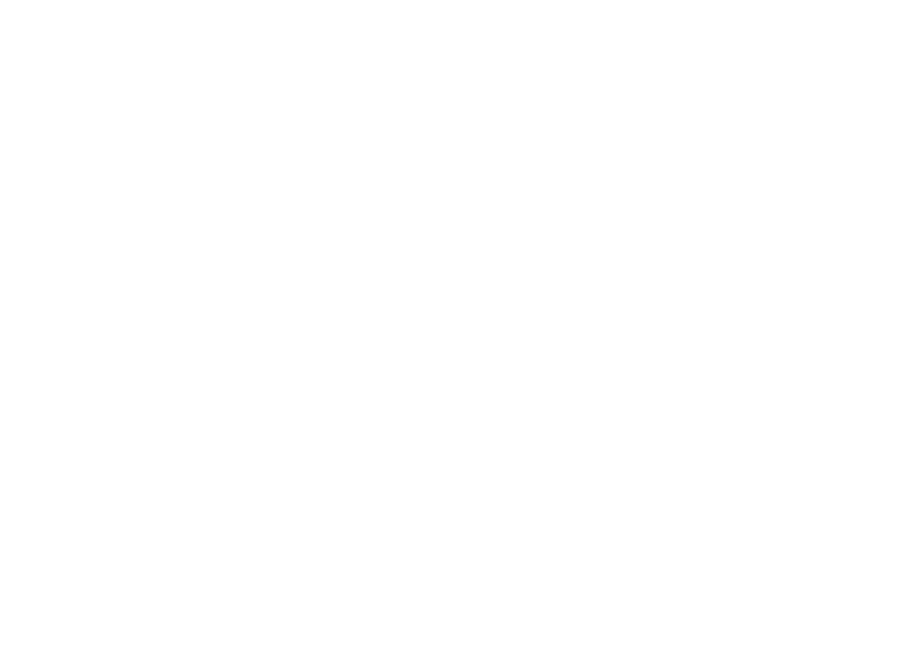

# Nome do projeto

> Projeto de automatização de busca de valores de financiamentos de veículos.

### Ajustes e melhorias

O projeto ainda está em desenvolvimento e as próximas atualizações serão voltadas nas seguintes tarefas:

- [x] Tarefa 1
- [x] Tarefa 2
- [x] Tarefa 3
- [ ] Tarefa 4
- [ ] Tarefa 5

## 🤝 Autores

<table>
  <tr>
    <td align="center">
      <a href="#" title="defina o titulo do link">
         
        
          <b>Iuri Silva</b>
        
      </a>
    </td>
  </tr>
</table>

